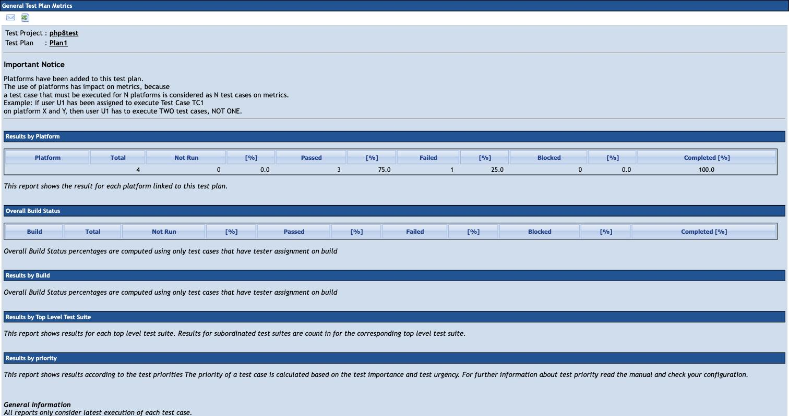
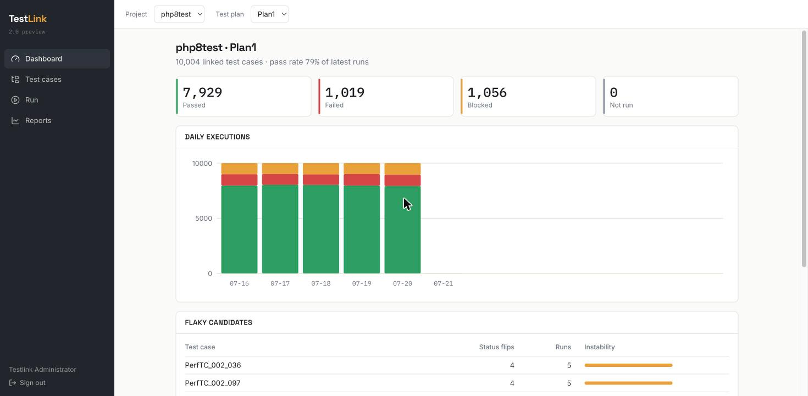
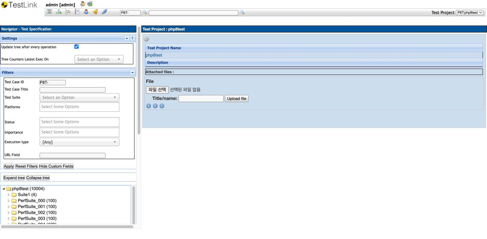
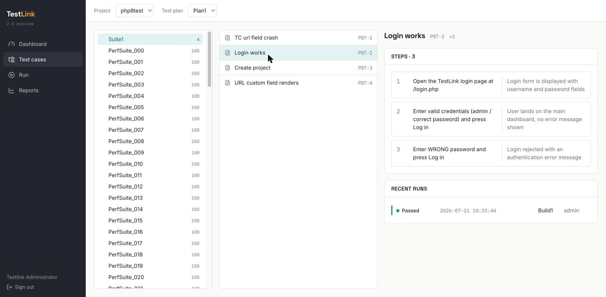
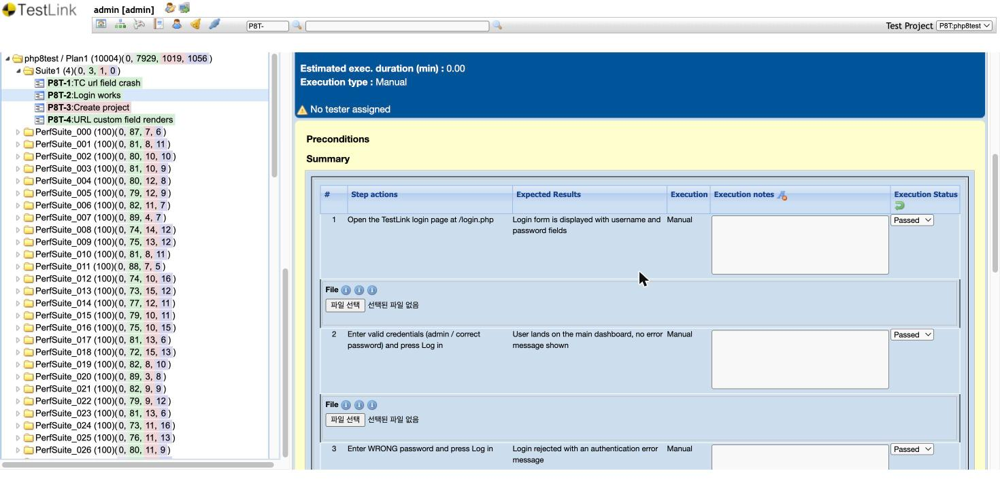
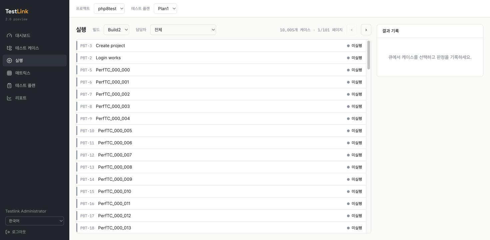
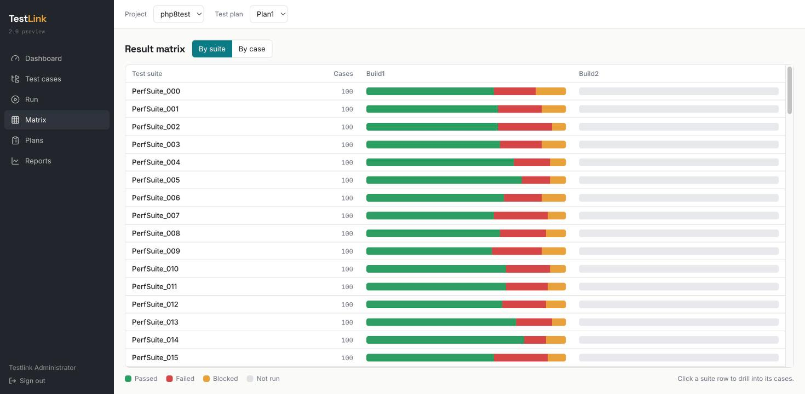
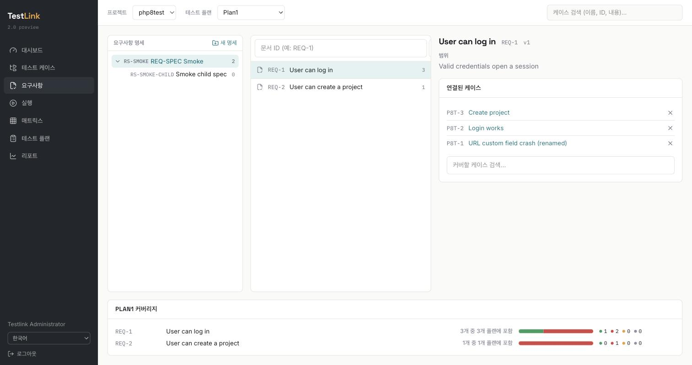
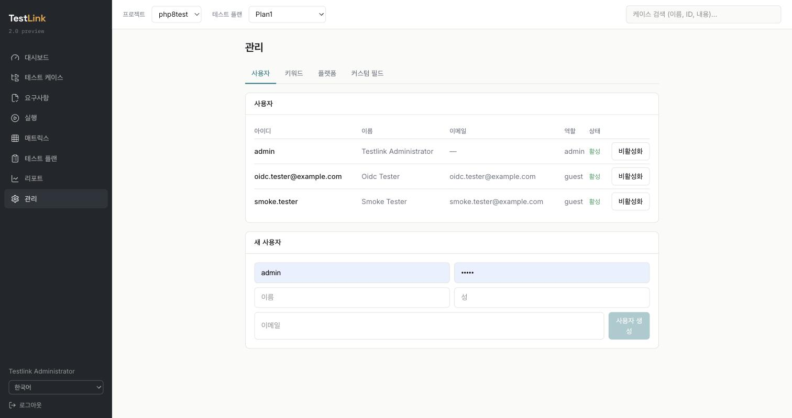

# TestLink Modernization (branch `php8-modernization`)

This document describes every change on the `php8-modernization`
branch, with before/after code for the important fixes, measured
performance numbers, installation steps, and cautions. It is meant to
be read next to the existing [README](../../README.md), which remains
authoritative for classic TestLink — nothing in the legacy application
was removed or redesigned; everything here is **additive**.

- **Base:** `testlink_1_9_20_fixed` @ `444bceb5f` (TestLink 1.9.20 "Raijin", 2025 refactor)
- **Branch:** `php8-modernization` — 9 commits, 62+ files, ≈13,000 added lines
- **Runtime verified on:** PHP 8.2.32, MariaDB 12.3.2, Node 24 (UI build only)
- **AI assistance:** developed in a Claude Code session powered by
  **Claude Fable 5**, with Sonnet/Opus subagents used for repetitive
  modules. Every change was runtime-verified against a live instance
  (10,000 test cases / 500,000 executions) before being committed.

---

## 1. PHP 8 fatal-error fixes (commit `fix: PHP 8 fatal errors…`)

These were hard crashes on PHP 8, found by running the application
(not just linting).

### 1.1 `lib/functions/string_api.php` — undefined constants + removed `split()`

Rendering **any value containing a URL** (e.g. a string custom field
shown through `string_display_links()`) crashed with
`Error: Undefined constant "LINKS_NEW_WINDOW"`. The constants were
adapted from MantisBT but never defined in TestLink. `split()` was
removed in PHP 7.0.

```php
// BEFORE (crashes on PHP 8)
if( config_get( 'html_make_links' ) == LINKS_NEW_WINDOW ) {  // undefined
...
list( $t_path, $t_param ) = split( '\?', $t_url, 2 );        // removed fn

// AFTER
if( !defined( 'LINKS_SAME_WINDOW' ) ) { define( 'LINKS_SAME_WINDOW', 1 ); }
if( !defined( 'LINKS_NEW_WINDOW' ) )  { define( 'LINKS_NEW_WINDOW', 2 ); }
...
list( $t_path, $t_param ) = explode( '?', $t_url, 2 );
```

### 1.2 `lib/api/xmlrpc/v1/xmlrpc.class.php` — parse error killed the whole XML-RPC API

```php
// BEFORE — parse error, the entire XML-RPC v1 API failed to load
$platformSet = (arrya)$this->tplanMgr->getPlatforms( $tplan_id, $opt );
// AFTER
$platformSet = (array)$this->tplanMgr->getPlatforms( $tplan_id, $opt );
```

### 1.3 Others
- `lib/api/rest/v3/custom/api/RestApiCustomExample.class.php` — bare
  `lib` constant (fatal on REST v3 load) → quoted.
- `lib/functions/testplan.class.php` — `${var}` string interpolation
  (deprecated 8.2) → `{$var}`.
- `tcImport.php`, `tcCreateFromIssue.php`, `neverRunByPP.php` —
  optional-parameter-before-required declarations.
- REST v3 `authenticate()` — header lookup now uses PSR-7
  `getHeaderLine()` (case-insensitive; proxies lowercase header names)
  and the 401 response it builds is actually returned
  (`$response->withStatus(401)` result was previously discarded).
- Known remaining upstream issue (worked around, not touched):
  `requirement_spec_mgr::create()`'s default `$type` references the
  undefined constant `TL_REQ_SPEC_TYPE_FEATURE`; all callers must pass
  the type explicitly (the new REST endpoint does).

## 2. Performance (commit `perf: add execution indexes…` and query reshapes)

Measured on a single plan with **500,000 execution rows**.

| Endpoint / page | Before | After | How |
|---|---|---|---|
| plan status totals | 123 ms (full scan) | **46 ms** | new index + query reshape below |
| flaky analysis (30-day window) | PHP memory-limit **fatal** | **~0.2 s** (365-day: 0.29 s) | window bound + row streaming |
| dashboard end-to-end (SPA, production build) | — | **~0.4 s** | 7.5× under a 3 s budget |
| legacy `resultsTC.php` result matrix | 11.1 MB HTML per view | ~30 KB (SPA equivalent) | pagination + by-suite rollup |

New migration `install/sql/alter_tables/1.9.21/mysql/DB.1.9.21/step1/db_schema_update.sql`:

```sql
ALTER TABLE /*prefix*/executions
  ADD INDEX /*prefix*/idx_exec_tplan_tcv_id (testplan_id, tcversion_id, id);
ALTER TABLE /*prefix*/executions
  ADD INDEX /*prefix*/idx_exec_tplan_ts (testplan_id, execution_ts);
```

Representative query reshape (`getPlanSummary`):

```sql
-- BEFORE: window function forces a scan of every execution of the plan
SELECT status, COUNT(*) FROM (
  SELECT E.status,
         ROW_NUMBER() OVER (PARTITION BY E.tcversion_id ORDER BY E.id DESC) rn
  FROM executions E WHERE E.testplan_id = ?) Z
WHERE rn = 1 GROUP BY status;

-- AFTER: loose index scan + PK join; cost follows #versions, not #executions
SELECT E2.status, COUNT(*) FROM (
  SELECT MAX(id) AS mid FROM executions
  WHERE testplan_id = ? GROUP BY tcversion_id) M
JOIN executions E2 ON E2.id = M.mid
GROUP BY E2.status;
```

## 3. New backend features

- **Webhooks** (`lib/functions/webhook_api.php`) — HMAC-SHA256-signed
  JSON POST (`X-TestLink-Signature`, GitHub style) on
  `execution.created`, fired from both the UI and API write paths.
  Best-effort with short timeouts; disabled unless `$tlCfg->webhooks`
  is configured.
- **Generic OIDC login** (`lib/functions/oauth_providers/oidc.php` +
  sample `cfg/oauth_samples/oauth.oidc.inc.php`) — works with any
  spec-compliant IdP (Keycloak, Okta, Auth0, Azure AD v2). Endpoints
  may be resolved from `.well-known/openid-configuration`. Identity is
  read from the `userinfo` endpoint over TLS (no local JWT
  verification needed). Also fixes an undefined-variable bug in the
  azuread branch of `OAuth2Call.php`.
- **~60 REST v3 JSON endpoints** powering the new UI (and useful
  standalone): auth login → API key, suites tree, case detail/update
  (step replace), case/suite/plan/build/project creation, plan link,
  execution recording, per-plan summary / trend / flaky / queue /
  matrix (case & suite) / by-tester / by-build / by-keyword,
  assignments, users admin, keywords, platforms, custom fields,
  requirements (specs, coverage, plan rollup), milestones, search,
  execution attachments (upload/list/download), printable documents,
  TestLink-XML export/import. Pagination via `?page=&limit=`
  everywhere it matters; legacy callers keep their old behavior.
- **Execution trend & flaky report** for the legacy UI too
  (`lib/results/resultsTrend.php`, dependency-free server-side SVG,
  registered in the reports menu).

## 4. New SPA (`ui/`)

React 19 + Vite + TypeScript + TanStack Router/Query + Tailwind v4.
103 KB gzipped, served as static files from `ui/dist/` by the same
web server — no extra services. Localized in **English, Korean,
Vietnamese** (typed dictionaries; an incomplete translation is a
compile error). Screens:

Dashboard · Test cases (tree, authoring with steps, XML import/export,
printable spec) · Requirements (specs, coverage, plan rollup) · Run
(work queue, verdict recorder, evidence attachments, assignments) ·
Matrix (by-suite ratio bars ⇄ paginated case grid) · Plans (projects,
plans, builds, milestones) · Reports (trend, build comparison,
by tester, by keyword, flaky, CSV, printable report) · Admin (users,
keywords, platforms, custom fields) · global search.

### Before / after

| Legacy | Modern |
|---|---|
|  |  |
|  |  |
|  |  |

More: 



## 5. MCP server & agent (`mcp/`, `.mcp.json`, `.claude/agents/`)

A Model Context Protocol server (TypeScript, stdio) exposing 19
agent-ergonomic tools (`search_cases`, `get_case`, `create_case`,
`record_execution`, `plan_status`, `plan_flaky`, `assign_cases`, …)
over the REST API, plus a ready-made `testlink-qa` Claude Code
subagent definition. See [mcp/README.md](../../mcp/README.md).

## 6. Installation

Classic installation is unchanged — follow the existing README.
Additions for this branch:

1. **PHP 8.2+ / MariaDB or MySQL** as usual; run the classic installer.
2. **Apply the new indexes** (existing installs):
   `install/sql/alter_tables/1.9.21/mysql/DB.1.9.21/step1/db_schema_update.sql`
   (replace `/*prefix*/` with your table prefix, usually empty).
3. **Build the SPA** (optional but recommended):
   ```bash
   cd ui && npm install && npm run build
   # then open http://<host>/ui/dist/index.html and sign in
   ```
4. **Webhooks / OIDC** (optional): copy the samples referenced in
   `config.inc.php` (`$tlCfg->webhooks`) and
   `cfg/oauth_samples/oauth.oidc.inc.php` into your
   `custom_config.inc.php`.
5. **MCP** (optional): `cd mcp && npm install && npm run build`, then
   export `TESTLINK_APIKEY` and open the repo in Claude Code
   (`.mcp.json` is auto-detected).

## 7. Cautions

- **Change the default `admin/admin` password** before exposing the
  instance anywhere.
- The SPA authenticates with the user's **API key** (minted at first
  SPA login via `POST /auth/login`); treat it like a password.
- The new REST endpoints require the `Apikey` header; 401 is returned
  otherwise (this was previously a 200 — clients relying on that bug
  should be updated).
- `deleteKeyword` also removes keyword↔case links (same as legacy
  management behavior).
- XML import skips cases whose **name already exists in the target
  suite** (idempotent re-import).
- Whole-project spec documents are capped at 2,000 cases with a
  visible truncation note.
- The flaky report defaults to a **30-day window** (`?days=`, max 365).
- The legacy frames UI is untouched and fully functional; the SPA is
  additive and can be adopted gradually.
- `ui/node_modules`, `ui/dist`, `mcp/node_modules`, `mcp/dist` are
  build artifacts (not committed).
