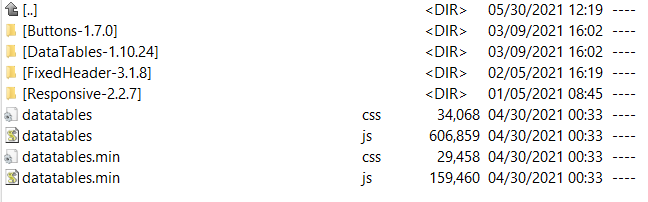
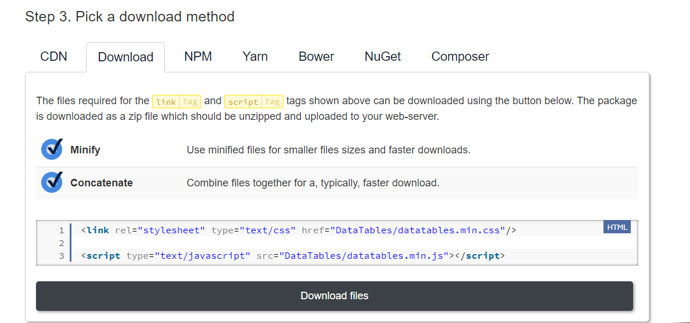
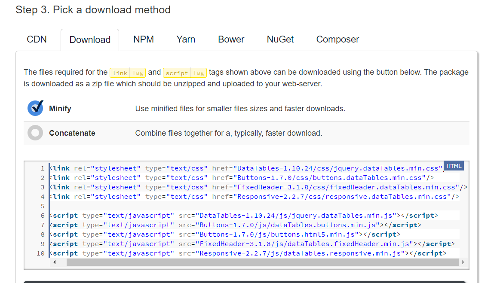

#20210530

#DataTables Download Builder Choices
These are the choices made when creating the DataTables download selecting additional packages  

#Why DataTables-1.10.24/images/ ?
Because I've missed the sort icons!!
I need to understand how to be able to use JUST images as folder
